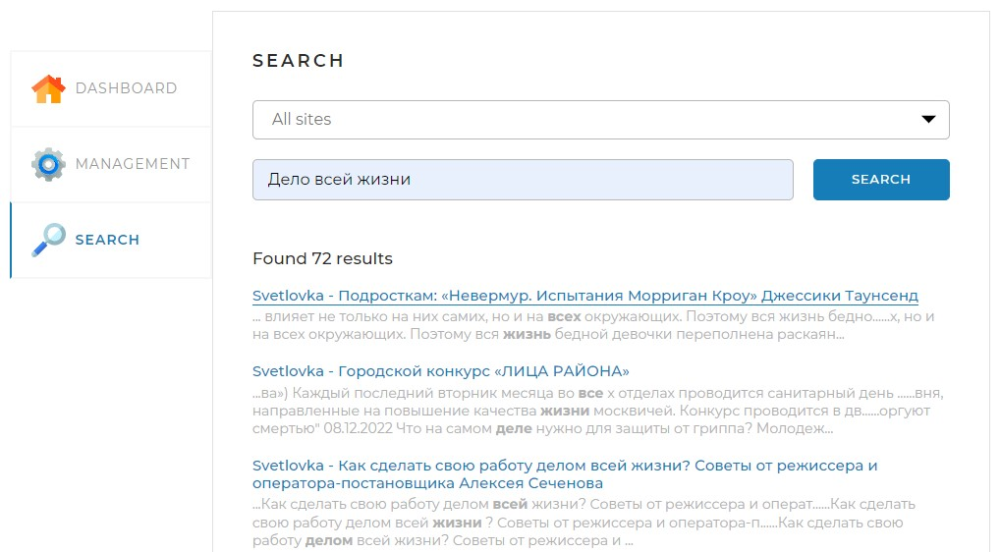
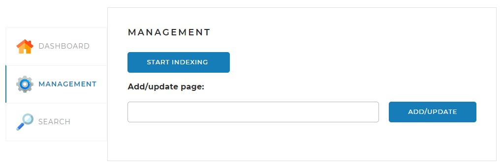
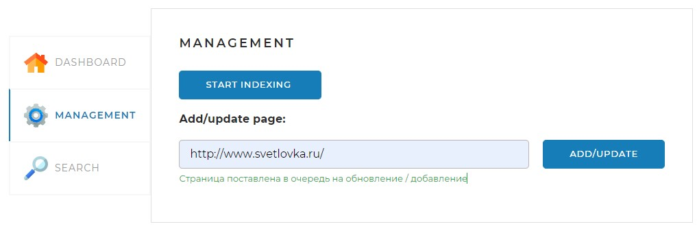
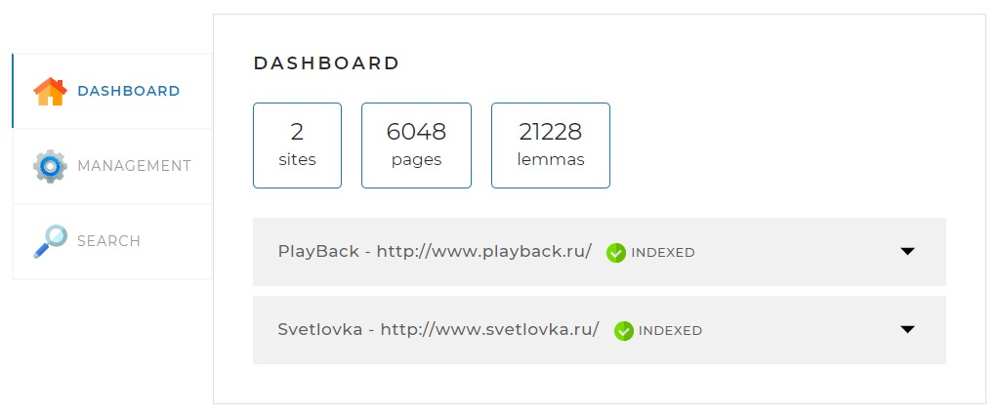
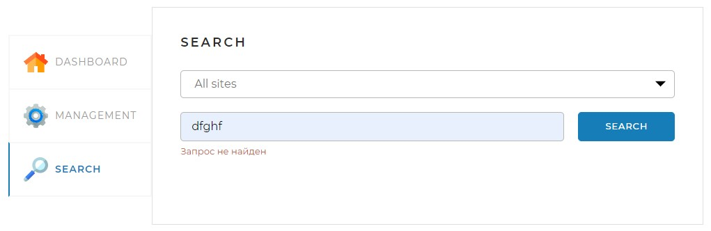
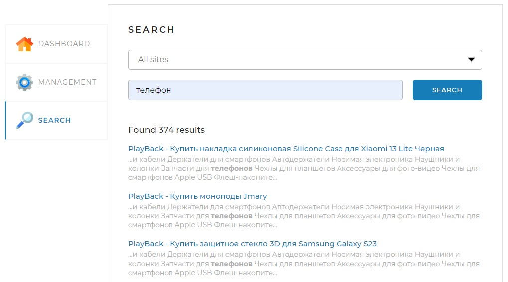
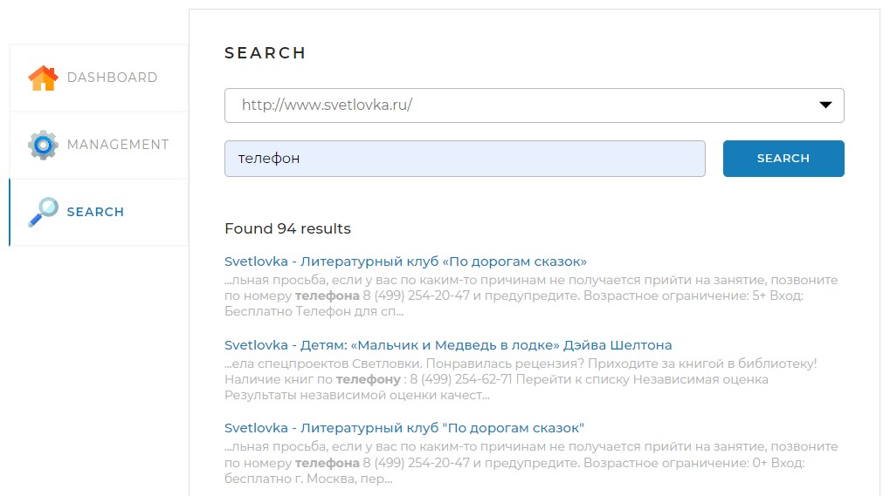
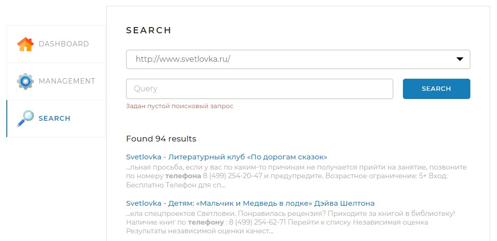

# Search Engine
## Стэк технологий
+ Java 17
+ Spring Framework
+ Spring Boot
+ Spring Data JPA
+ Spring Web
+ Maven
+ Hibernate
+ MySQL8
## Описание
Локальное приложение, поисковая система, которая находит информацию на интересующих 
нас сайтах. Найденная информация предоставляется в виде списка ссылок с найденным 
текстом. Перейдя по ссылке, попадаем на страницу, где находится нужный текст.

## Инструкция по локальному запуску

+ Создайте базу данных в MySQL80 с именем search_engine
+ Установите JDK Java 17
+ В приложении в файле application.yaml укажите параметры подключения

## Инструкцию по работе с программой
### Management

ADD/UPDATE - Здесь мы указываем на каком сайте нужно выполнять поиск. Добавляя или 
обновляя страницу (см. ниже):

START INDEXING - Здесь мы можем запустить обработку(индексацию) сайтов, а также 
повторным нажатием прервать данный процесс. 
### Dashboard

Здесь выводится общая статистика по индексации. А именно, сколько сайтов было 
проиндексировано, страниц и лемм(слов). Ниже описание отдельного сайта, с его статусом.
### Search

Здесь мы можем выбрать поиск по всем сайтам или одному. Ниже пишем, что нас интересует найти.
Если слово не найдено, оповещаем об этом. (см. ниже):

Если слово или несколько слов нашлось, то выводится результат(см. ниже):

Результат поиска на отдельной странице:

Результат поиска при заданном пустом запросе:

